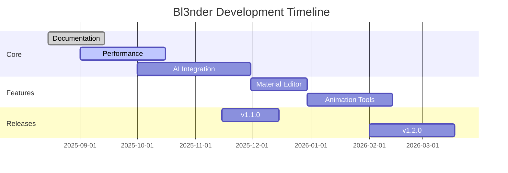

# 🗺️ Bl3nder Roadmap

This document outlines the future direction and planned features for Bl3nder.

## 🚀 Upcoming Features

### Q4 2025 - Bl3nder 1.1 "Cosmic Forge"
- **AI Material Generation**
  - Real-time material synthesis
  - Style transfer for materials
  - PBR material optimization

- **Performance**
  - Multi-GPU support
  - Out-of-core rendering
  - Faster viewport performance

### Q1 2026 - Bl3nder 1.2 "Neural Nexus"
- **AI Animation**
  - Motion prediction
  - Auto-rigging 2.0
  - Facial animation from audio

- **Workflow**
  - Context-aware toolset
  - Smart asset management
  - Enhanced undo/redo with AI

## 🔄 In Progress

### Current Sprint (September 2025)
- [ ] Documentation improvements
- [ ] Performance optimizations
- [ ] Bug fixes and stability

## 📅 Future Considerations

### Research Areas
- Real-time ray tracing with AI denoising
- Neural rendering techniques
- Cloud-based AI processing

### Community Requests
- [ ] Better Linux support
- [ ] More export formats
- [ ] Improved VR workflow

## 🤝 Contributing to the Roadmap

1. **Vote on Features**
   - React with 👍 to features you want to see
   - Add detailed comments about use cases

2. **Propose New Features**
   - Open a new issue with the "feature request" label
   - Follow the template for feature requests

3. **Join the Discussion**
   - [GitHub Discussions](https://github.com/MKWorldWide/Bl3nder/discussions)
   - [Discord Community](https://discord.gg/mkworldwide)

## 📊 Progress Tracking

## 📝 Versioning Policy

- **Major versions (X.0.0)**: Breaking changes
- **Minor versions (1.X.0)**: New features, backward compatible
- **Patch versions (1.0.X)**: Bug fixes and improvements

## 📬 Stay Updated

- Watch releases on GitHub
- Join our [newsletter](https://mkworldwide.com/newsletter)
- Follow us on [Twitter](https://twitter.com/MKWorldWide)
